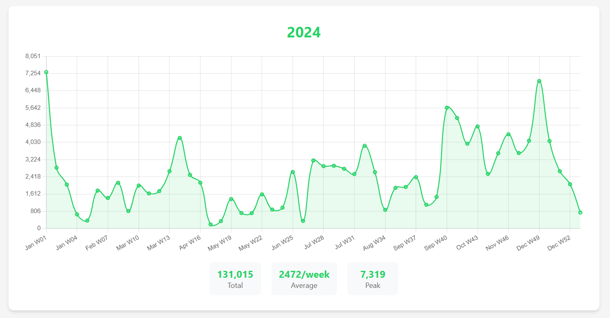

# 📱 WhatsApp Chat Analyzer

A powerful web-based tool to analyze and visualize your WhatsApp chat patterns over time. Export your chats and discover insights about your messaging frequency with beautiful, interactive charts.



## ✨ Features

- **📊 Multiple Chart Types**: Line charts for trends, bar charts for detailed analysis
- **📅 Multi-Year Support**: Separate charts for each year with consistent scaling
- **⏱️ Flexible Time Grouping**: Daily, weekly, or monthly data aggregation
- **🎯 Smart Analytics**: Total messages, averages, and peak activity insights
- **🔒 Privacy-Focused**: All processing happens locally on your server
- **📱 Responsive Design**: Works seamlessly on desktop and mobile devices
- **💚 WhatsApp Theme**: Authentic WhatsApp-inspired color scheme and styling

## 🚀 Quick Start

### Prerequisites
- PHP 7.0+ with file system access
- Web server (Apache, Nginx, or PHP built-in server)

### Installation

1. **Clone the repository**:
   ```bash
   git clone https://github.com/yourusername/whatsapp-histogram.git
   cd whatsapp-histogram
   ```

2. **Start the server**:
   ```bash
   php -S localhost:8000
   ```

3. **Open in browser**: Navigate to `http://localhost:8000`

### Adding Your Chat Data

1. **Export WhatsApp Chat**:
   - Open WhatsApp on your mobile device
   - Go to **Settings** → **Chats** → **Chat History**
   - Tap **"Export Chat"**
   - Pick the contact/group you want to analyze
   - Choose **"Without Media"** (text only)
   - Save the `.txt` file

2. **Add to Project**:
   - Copy the exported `.txt` file to the `chats/` directory
   - Name it whatever you like (e.g., `john_doe.txt`, `family_group.txt`)
   - Refresh the web page - your chat will appear in the dropdown

3. **Start Analyzing**:
   - Select your chat file from the dropdown
   - Choose chart type (Line/Bar)
   - Pick time grouping (Daily/Weekly/Monthly)
   - Explore your messaging patterns!

## 🛠️ Technical Details

### Architecture
- **Backend**: PHP with efficient file streaming for large chat files
- **Frontend**: Vanilla JavaScript with Chart.js for visualizations
- **Data Processing**: Real-time parsing with memory-efficient algorithms
- **Security**: Path validation and file access protection

### Supported Features
- **Date Formats**: Handles both 2-digit and 4-digit year formats
- **Unicode Support**: Properly processes WhatsApp's special characters
- **Large Files**: Memory-efficient streaming for multi-MB chat exports
- **Multi-language**: Works with WhatsApp exports in different languages

### File Structure
```
whatsapp-histogram/
├── index.php          # Main application interface
├── process_chat.php    # Backend data processing
├── chats/             # Directory for your chat exports
│   └── .gitkeep       # Keeps directory in git
├── screenshot.png     # Application preview
└── README.md         # This file
```

## 🔧 Configuration

The tool works out-of-the-box with default settings, but you can customize:

- **Memory Limit**: Adjust `memory_limit` in `process_chat.php` for very large files
- **Execution Time**: Modify `max_execution_time` for complex processing
- **Chart Colors**: Update CSS variables for custom theming

## ⚠️ Privacy & Security

- **Local Processing**: All chat data is processed locally on your server
- **No External Requests**: Data never leaves your environment
- **File Security**: Built-in path validation prevents unauthorized file access
- **Clean URLs**: No sensitive data exposed in URLs or logs

## 🐛 Troubleshooting

**Chat not appearing in dropdown?**
- Ensure the `.txt` file is in the `chats/` directory
- Refresh the page after adding new files
- Check that the file has a `.txt` extension

**Charts not loading?**
- Verify the chat file format matches WhatsApp exports
- Check browser console for JavaScript errors
- Ensure PHP has read permissions on the `chats/` directory

**Large file processing slowly?**
- Increase PHP memory limit in `process_chat.php`
- Consider using weekly/monthly grouping for better performance

## 📝 License

This project is open source and available under the [MIT License](LICENSE).
